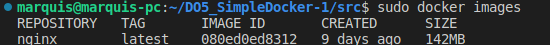
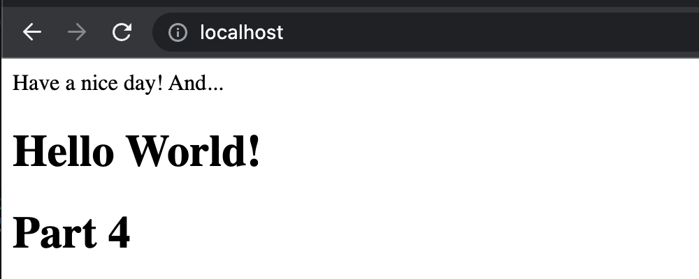

## Part 1. Готовый докер

- 1.1 Взяла официальный докер образ с **nginx** и выкачала его при помощи `docker pull`

- 1.2 Проверила наличие докер образа через `docker images`

- 1.3 Запустила докер образ через `docker run -d [image_id|repository]`

- 1.4 Проверила, что образ запустился через `docker ps`

- 1.5 Посмотрела информацию о контейнере через `docker inspect [container_id|container_name]`

- 1.6.1 Размер контейнера

- 1.6.2 Список замапленных портов

>Замапленные порты (Mapped ports) - это механизм, который позволяет связать порты на хостовой машине
>с портами внутри контейнера Docker. Это позволяет сделать приложения в контейнере доступными
>для других приложений на хостовой машине или в сети.

- 1.6.3 ip контейнера

- 1.7 Остановила докер образ через `docker stop [container_id|container_name]`

- 1.8 Проверила, что образ остановился через `docker ps`

- 1.9 Запустила докер с портами 80 и 443 в контейнере, замапленными на такие же порты на локальной машине, через команду *run*

- 1.10 Проверила, что в браузере по адресу *localhost:80* доступна стартовая страница **nginx**

- 1.11 Перезапустила докер контейнер через `docker restart [container_id|container_name]`

- 1.12 Проверила любым способом, что контейнер запустился

## Part 2. Операции с контейнером

- Прочитала конфигурационный файл *nginx.conf* внутри докер контейнера через команду *exec*

- Создать на локальной машине файл *nginx.conf*

- Настроить в нем по пути */status* отдачу страницы статуса сервера **nginx**

- Скопировать созданный файл *nginx.conf* внутрь докер образа через команду `docker cp`

- Перезапустить **nginx** внутри докер образа через команду *exec*

- Проверить, что по адресу *localhost:80/status* отдается страничка со статусом сервера **nginx**

- Экспортировать контейнер в файл *container.tar* через команду *export*

- Остановить контейнер

- Удалить образ через `docker rmi [image_id|repository]`, не удаляя перед этим контейнеры

- Удалить остановленный контейнер

- Импортировать контейнер обратно через команду *import*

- Запустить импортированный контейнер

- Проверить, что по адресу *localhost:80/status* отдается страничка со статусом сервера **nginx**

## Необязательная документация. 
## Part 3. Мини веб-сервер

- запускаю контейнер с образом nginx 

- копирую написанные файлы в контейнер 

- захожу в контейнер в интерактивном режиме через команду docker exec -it [container id] /bin/bash

- устанавливаю ПО для запуска сервера 

- запускаю сервер, перезагружаю nginx 

- Вижу что на нужном мне порту localhost отдается моя страничка 

## Part 4. Свой докер

- Собираю докер образ, при этом указывая имя и тег 

- Видим, что все корректно собралось 

-  Запускаю собранный докер образ с маппингом 81 порта на 80 на локальной машине и маппингом папки *./nginx* внутрь контейнера по адресу, где лежат конфигурационные файлы **nginx**'а

- Проверить, что по localhost:80 доступна страничка написанного мини сервера

- Проверить, что теперь по *localhost:80/status* отдается страничка со статусом **nginx**

## Part 5. **Dockle**

- при запуске dockle получаю следующие ошибки: 
   - CIS-DI-0010: Не храните учетные данные в переменных окружения или файлах
   - DKL-DI-0005: нужно очистить кеш после выполнения команды apt-get 
   - CIS-DI-0001: создать пользователя для контейнера

- исправленный dockerfile в соответствии с рекомендациями. Отсутствуют warn и fatal
> https://github.com/goodwithtech/dockle/issues/130

## Part 6. Базовый **Docker Compose**

> исходные файлы в каталоге 

- собираем и запускаем проект 

-  в браузере по *localhost:80* отдается написанная страничка, как и ранее
